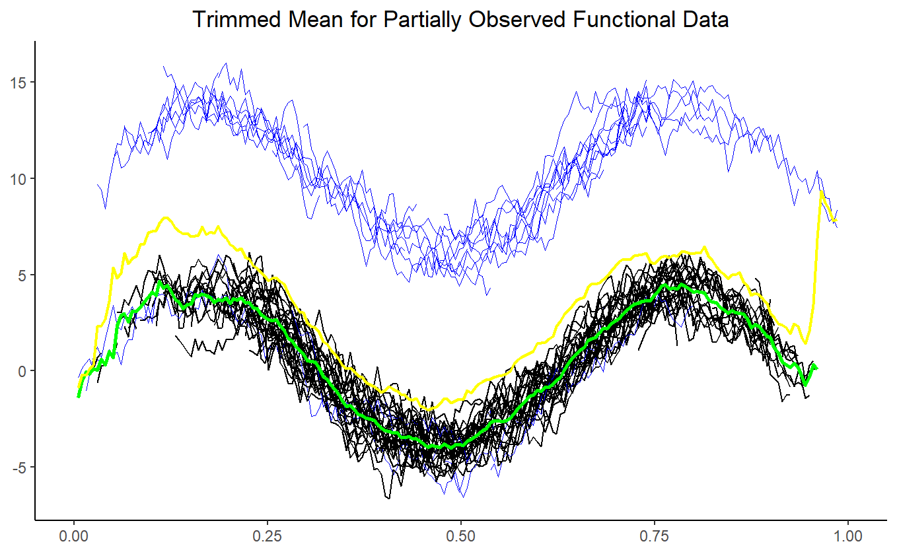

# TMoPOFD: Trimmed Mean for Partially Observed Functional Data

This repository contains the simulation code for the **Trimmed Mean for Partially Observed Functional Data (TMoPOFD)**, based on the Partially Observed Integrated Functional Depth (POIFD) method.

## Overview

This software accompanies the paper titled *“Trimmed Mean for Partially Observed Functional Data”* by Yixiao Wang, which extends the work on the POIFD method. This is my bachelor's thesis. The work primarily references the following studies:

- **Integrated Depths for Partially Observed Functional Data**  
  *Authors*: A. Elías, R. Jiménez, A. M. Paganoni, L. M. Sangalli  
  *Journal*: Journal of Computational and Graphical Statistics (2022)  
  *DOI*: [10.1080/10618600.2022.2070171](https://doi.org/10.1080/10618600.2022.2070171)

- **Trimmed Means for Functional Data**  
  *Authors*: Ricardo Fraiman, Graciela Muniz  
  *Institutions*: Universidad de San Andrés, Buenos Aires, Argentina & Universidad de la República, Montevideo, Uruguay  
  *Year*: May 2001  
  *AMS 1980 Subject Classifications*: 62G07, 62G05  
  *DOI*: [10.1007/BF02595706](https://doi.org/10.1007/BF02595706)

This code aims to define the trimmed mean for partially observed functional data using the POIFD method and to establish the strong convergence of this estimator. Additionally, the code uses the package from the study *Integrated Depths for Partially Observed Functional Data* to generate POIFD-related work, which is available at [https://github.com/aefdz/fdaPOIFD](https://github.com/aefdz/fdaPOIFD).

### Mathematical Definition

The $\alpha$-trimmed mean for partially observed functions is defined as the mean of the $n - \lfloor n\alpha \rfloor$ deepest observed values. More precisely, for $\beta > 0$, the sample version of the trimmed mean is given by:

```math
\hat{\mu}_{n}(t) = \frac{\sum_{i=1}^{n} \mathbf{1}_{[\beta,+\infty)}\left(\text{POIFD}\left(X_{i}\right)\right)\mathbf{1}_{\text{observed}}\left(X_{i}(t)\right) X_{i}(t)}{\sum_{i=1}^{n} \mathbf{1}_{[\beta,+\infty)}\left(\text{POIFD}\left(X_{i}\right)\right)\mathbf{1}_{\text{observed}}\left(X_{i}(t)\right)} ,
```

where $\beta$ satisfies:

```math
\frac{1}{n} \sum_{i=1}^{n} \mathbf{1}_{[\beta,+\infty)}\left(\text{POIFD}\left(X_{i}\right)\right) \simeq 1-\alpha ,
```
where POIFD(X) is the Partially Observed Integrated Functional Depth of $X$. For more details, see [Integrated Depths for Partially Observed Functional Data](https://doi.org/10.1080/10618600.2022.2070171).
## Test Usage

Below is an example of how to simulate data and plot the trimmed mean using this code:

```r
# Simulate the data
SimulateModel <- simulateModel(
  len = 200,
  p = 50,
  q = 0.3,
  M = 10,
  pollution_type = "asymmetric"
)

# Plot the data
plotTrimmedMean(data, alpha = 0.3, type = "FMD")
```
In the plot, the green line represents the trimmed mean, the yellow line represents the mean before trimming, and the blue lines represent the functions that were trimmed.


